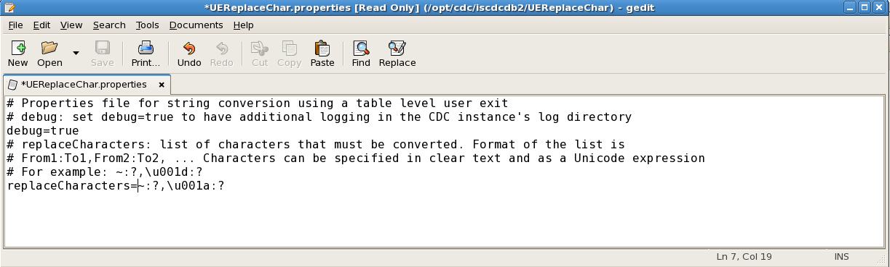
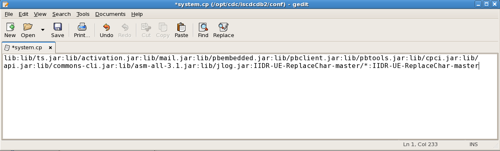
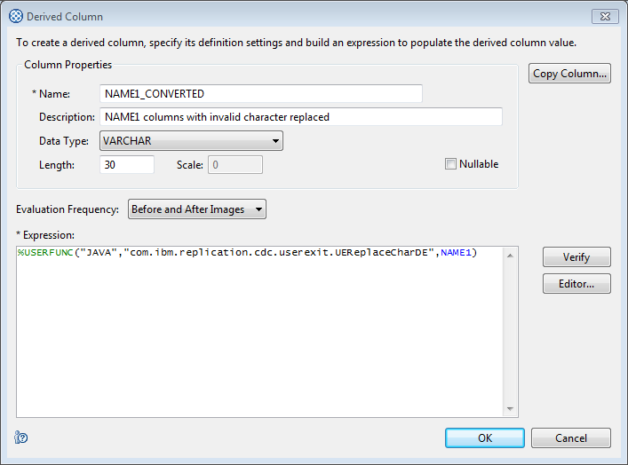
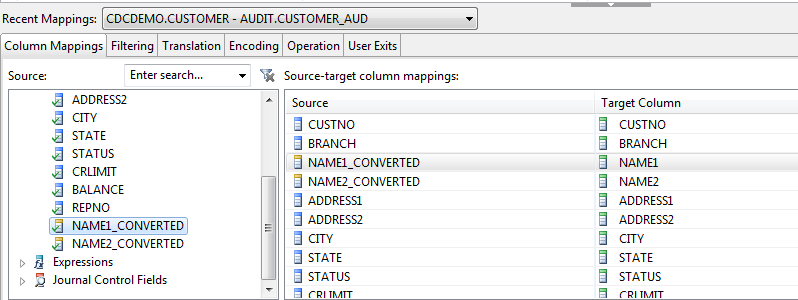

# IBM InfoSphere Data Replication CDC - Replace characters before apply

When replicating data from a source database to the target, InfoSphere CDC automatically applies a conversion to ensure that character data is applied in the encoding that is applicable to the target database. For example, if the source data is in the IBM-037 encoding and the target is UTF-8 (Unicode), the target engine transforms the data such that it matches the expected encoding. This even applies to the non-printable characters, as long as there is a match in the target codepage.

In some cases, such as when replicating to Teradata, non-printable characters have a special meaning in the database and may not be used in character data. The user exit in this package allows you to search the specified columns for such characters and to substitute them by a character that is allowed by the target database engine.

## Installation
The GitHub repository contains the source but also the user exit in its compiled form, enclosed in a jar file. If you wish, you can build the jar file yourself using Ant, or to manually compile the user exit. If you wish to do so, please refer to the [Compilation](#compilation) section.

Download and unzip the master zip file from GitHub through the following link: [Download Zip](https://github.com/fketelaars/IIDR-UE-ReplaceChar/archive/master.zip). The unzipped directory can be placed anywhere on the server that runs the CDC target engine; we recommend to unzip it under the CDC engine's home directory (hereafter referred to as `<cdc_home>`)

## Configuration
In most scenarios you will need to perform a couple of configuration tasks:
- Update the configuration properties in the UEReplaceChar.properties file
- Add the user exit and its configuration file to the classpath of the CDC *source* engine in case you want to use the derived expression user exit UEReplaceCharDE
- Add the user exit and its configuration file to the classpath of the CDC *target* engine in case you want to use table level user exit UEReplaceChar

### Setting the configuration properties
Update the `UEReplaceChar.properties` file with your favourite editor and specify the characters which you want to have replaced and their replacement value (`replaceCharacters`). When running the user exit for the first time, you may also want to set the `debug`property to `true` to add additional logging to the CDC traces.

An example of character replacement can be found below. In the properties file that is shown, debugging has been switched on and special characters such as the tilde (~) and the Unicode 0x1d separator are replaced by a question mark.

### Update the CDC engine's classpath
Assuming you have unzipped the file under the `<cdc_home>` directory, and the directory is called `IIDR-UE-ReplaceChar-master`, add the following entries to the end of the classpath specified in the `<cdc_home>/conf/system.cp`:  
`:IIDR-UE-ReplaceChar-master/lib/*:IIDR-UE-ReplaceChar-master`

Example classpath for CDC engine:
 

Once you have updated the classpath, restart the CDC instance(s) for the change to take effect.

## Usage as Table Mapping user exit
The first option for configuration is to employ the user exit in the table mappings, causing the column conversion to execute in the target engine. A side effect of configuring the user exit this way is that fastload apply may be disabled during the refresh of a table.

When mapping a table, specify the `com.ibm.replication.cdc.userexit.UEReplaceChar`class for the `before-insert`, `before-update` and `before-delete` exit points. In the user exit parameters, specify a list of comma-separated columns in which you want to replace the characters.

Example table mapping:
 

Now, when you start the subscription, check the target table and see that the specified characters have been replaced as configured in the properties file.

## Usage as a Derived Expression user exit
The second option for configuration is to employ the user exit as a derived expression used in a derived column. This causes the column conversion to be executed in the source engine. Although this leads to additional CPU usage in the source engine, fastload apply can be used to refresh the tables.

When mapping a table, create a derived column for every column you want to convert. Specify the `com.ibm.replication.cdc.userexit.UEReplaceCharDE` class for the `%USERFUNC` function, and use the original column as the first and only parameter.

Example derived column:
 
 
After you've defined the derived columns for the columns you wish to convert, proceed with the mapping of the derived columns to the target table's columns. Example:
 

### Debugging
In case the results of the character replacement do not match your expectations, you can enable debugging for the user exit. It will then write additional traces in the CDC instance logs, which can be found in `<cdc_home>/instance/<instance>/log`. Log entries from the user exit are marked with `com.ibm.replication.cdc.userexit.UETrace`.

When the subscription is started and the first time the user exit is loaded, the properties file is retrieved. In case of the Derived Expression user exit, the properties will be loaded again if it has been more than 10 seconds ago since it has been  loaded the last time. You will see the following messages:

    85      2016-05-28 14:40:43.746 DB2_AUD Target Data Channel{98} com.ibm.replication.cdc.userexit.UETrace        writeAlways()   Reading configuration from properties file UEReplaceChar.properties
    86      2016-05-28 14:40:43.746 DB2_AUD Target Data Channel{98} com.ibm.replication.cdc.userexit.UETrace        writeAlways()   debug=true
    87      2016-05-28 14:40:43.746 DB2_AUD Target Data Channel{98} com.ibm.replication.cdc.userexit.UETrace        writeAlways()   replaceCharacters=a:q,d:e,A:y,~:?,\J:\M
    88      2016-05-28 14:40:43.746 DB2_AUD Target Data Channel{98} com.ibm.replication.cdc.userexit.UETrace        writeAlways()   Character a (61) will be replaced by q (71)
    89      2016-05-28 14:40:43.746 DB2_AUD Target Data Channel{98} com.ibm.replication.cdc.userexit.UETrace        writeAlways()   Character d (64) will be replaced by e (65)
    90      2016-05-28 14:40:43.746 DB2_AUD Target Data Channel{98} com.ibm.replication.cdc.userexit.UETrace        writeAlways()   Character A (41) will be replaced by y (79)
    91      2016-05-28 14:40:43.746 DB2_AUD Target Data Channel{98} com.ibm.replication.cdc.userexit.UETrace        writeAlways()   Character ~ (7e) will be replaced by ? (3f)
    92      2016-05-28 14:40:43.746 DB2_AUD Target Data Channel{98} com.ibm.replication.cdc.userexit.UETrace        writeAlways()   Character \J (1a) will be replaced by \M (1d)
    93      2016-05-28 14:40:43.746 DB2_AUD Target Data Channel{98} com.ibm.replication.cdc.userexit.UETrace        writeAlways()   Number of elements in the conversion map: 5
    94      2016-05-28 14:40:43.746 DB2_AUD Target Data Channel{98} com.ibm.replication.cdc.userexit.UETrace        writeAlways()   Columns that will be converted: [NAME1, NAME2]
 
If you have switched on debugging, additional information will be logged when the conversion is done.

    138     2016-05-28 14:41:10.017 DB2_AUD Target Apply:0{115}     com.ibm.replication.cdc.userexit.UETrace        writeAlways()   Column DESCRIPTN has type VARCHAR
    139     2016-05-28 14:41:10.017 DB2_AUD Target Apply:0{115}     com.ibm.replication.cdc.userexit.UETrace        writeAlways()   Column LOCATION has type VARCHAR
    140     2016-05-28 14:41:10.017 DB2_AUD Target Apply:0{115}     com.datamirror.ts.eventlog.EventLogger  logActualEvent()        Event logged: ID=4181 MSG=User exit program has generated a message. Warning: Specified column NOTEXIST not found, will be ignored.
    141     2016-05-28 14:41:10.017 DB2_AUD Target Apply:0{115}     com.ibm.replication.cdc.userexit.UETrace        writeAlways()   Column DESCRIPTN content aaaaAAAA (61 61 61 61 41 41 41 41)  converted to qqqqyyyy (71 71 71 71 79 79 79 79)
    142     2016-05-28 14:41:10.017 DB2_AUD Target Apply:0{115}     com.ibm.replication.cdc.userexit.UETrace        writeAlways()   Column LOCATION content Aisle 1 (41 69 73 6c 65 20 31)  converted to yisle 1 (79 69 73 6c 65 20 31)

## Compilation
If you wish to compile the user exit yourself, the easiest method is to use Ant ([https://ant.apache.org/bindownload.cgi](https://ant.apache.org/bindownload.cgi)). 

Once you have this installed:
- Ensure that the ant executable is in the path
- Go to the directory where you unzipped the user exit master file
- Update the `ant.properties` and update the `CDC_ENGINE_HOME` property to match the location where you installed the CDC engine
- Check the target version to be used (this is the Java version of the compiled objects) and should match the version of the Java Runtime Engine that is included with CDC
- Run `ant`
- First the sources will be compiled into their respective .class files and finally the class files are packaged into a jar 

